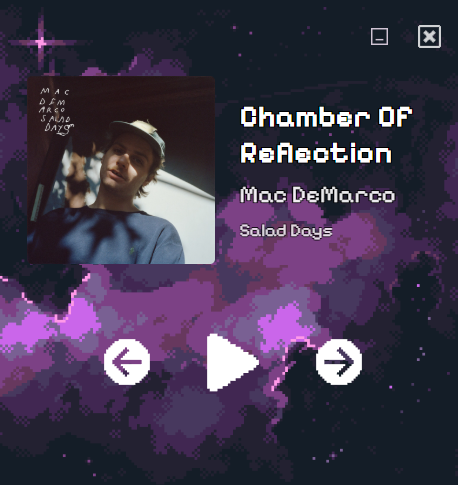
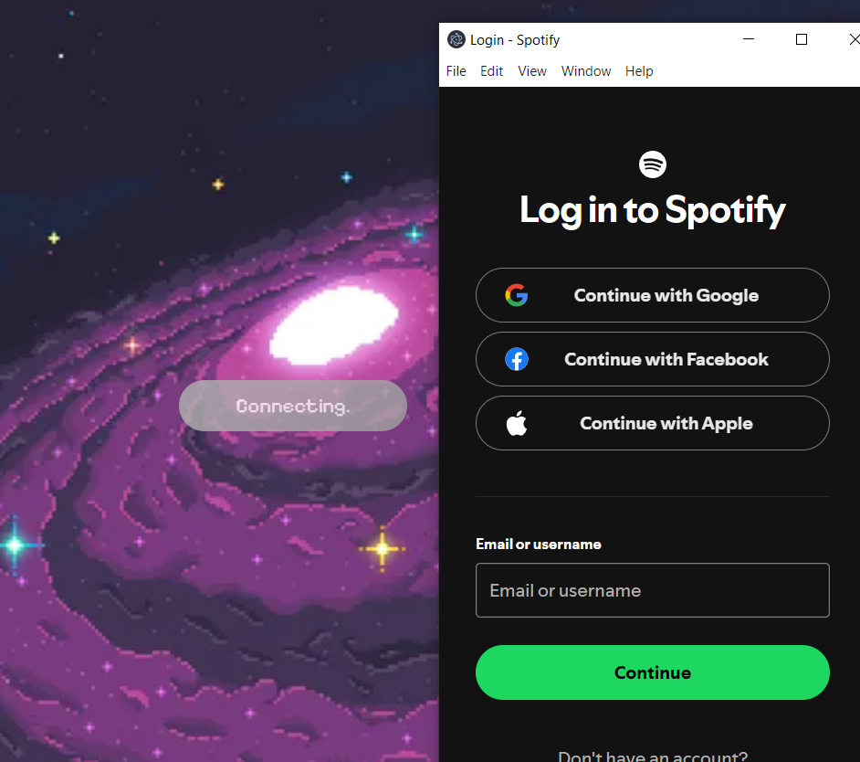

# Spotify Pixel Player

  
*A sleek, lightweight Spotify player with visual genre theming*

## 🎯 Purpose
A minimal Electron desktop application that:
- Displays currently playing Spotify tracks
- Dynamically changes UI based on music genre
- Provides playback controls without leaving your workflow
- Works natively on Windows/macOS/Linux

## 🛠 Tech Stack
- **Frontend**: 
  - Electron (Cross-platform desktop runtime)
  - Vite (Ultra-fast build tool)
  - React + TypeScript (Type-safe UI components)
  - CSS Modules (Scoped styling)

- **Backend**:
  - Spotify Web API (OAuth 2.0 authentication)
  - Electron IPC (Inter-process communication)
  - PKCE (Secure authorization flow)

## ✨ Key Features
1. **Genre-Responsive UI**  
   Backgrounds dynamically change based on track genre using:
   - Spotify Artist API genre data
   - NativeImage for cross-platform asset handling
   - Smooth CSS transitions

2. **Zero-UI Mode**  
   - Custom frameless window
   - Draggable titlebar
   - Always-on-top option (via Electron APIs)

3. **Instant Controls**  
   - Play/Pause, Skip, Previous
   - Keyboard media key support
   - System tray controls

## 🖼️ UI Components
| Component | Description |
|-----------|-------------|
|| Album art + track metadata |
|  | Minimal playback controls |
| | Secure OAuth 2.0 flow |

## 🚀 Installation
```bash
# 1. Clone repository
git clone https://github.com/EricLarwa/MiniPlayer.git

# 2. Install dependencies
npm install

# 3. Initialize Auth-server
cd electron
node auth-server.js

# 3. Run in development
cd MiniPlayer
npm run dev

# 4. Build for production
npm run build

#6. Run in electron
npm run electron
```

## 📚 Documentation
- [Spotify API Reference](https://developer.spotify.com/documentation/web-api/)
- [Electron Docs](https://www.electronjs.org/docs)
- [Vite Configuration](https://vitejs.dev/config/)
